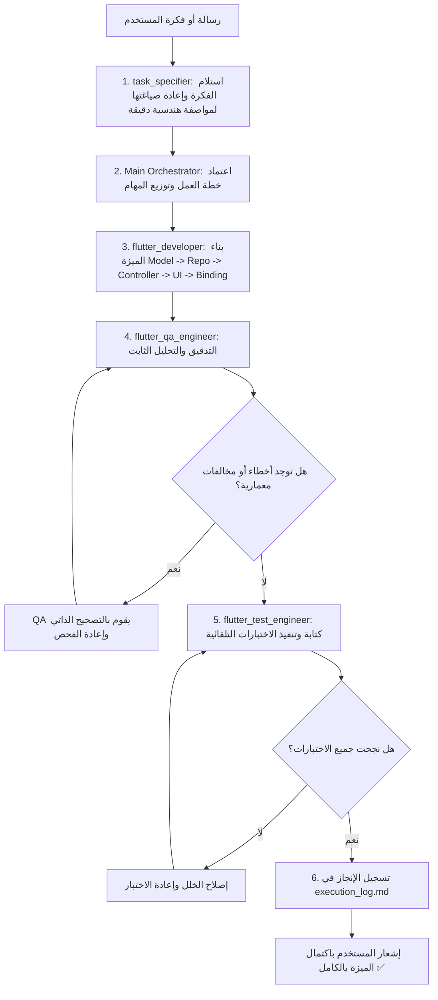

# 📋 Life Daily - Multi-Agent Execution Log

هذا الملف يوثق جميع المهام، الميزات، والتحسينات المنجزة عبر حلقة الوكلاء المتخصصين (Sub-Agents Loop).

---

## 👥 الوكلاء المعرفون في النظام (Active Specialized Sub-Agents)

| الوكيل (Agent Name) | الدور (Role) | المسؤوليات الرئيسية (Responsibilities) |
|---|---|---|
| **`task_specifier`** | **مهندس ومحلل المهام (Task Architect & Specifier)** | - **المستقبل الأول لرسائل وأفكار المستخدم**. - تحويل الفكرة المبدئية إلى مواصفات هندسية دقيقة (Technical Spec). - تحديد المسارات، حزم الـ Models، ومفاتيح الترجمة وتوكنات التصميم. - تفكيك المهمة إلى مهام تنفيذية دقيقة للمطور والـ QA والاختبارات. |
| **`flutter_developer`** | **مطور الواجهات والميزات (Feature Developer)** | - استلام المواصفات من `task_specifier`. - كتابة Models, Repositories, Controllers, Widgets, Pages, Bindings. - الالتزام الصارم بنمط GetX الإجرائي (`update(['id'])` مع `GetBuilder`) وبدون `.obs` أو `Obx`. - استخدام رموز التصميم (`context.appPalette`, `AppSpacing`, `AppRadius`, `LocaleKeys`). - ربط التوجيه عبر `AppNavigator` بدون أسماء مسارات نصية. |
| **`flutter_qa_engineer`** | **مهندس الجودة ومراجع الكود (QA & Code Auditor)** | - فحص الكود للتأكد من خلوه من الأنماط الممنوعة (`.obs`, `Obx`, ألوان/نصوص hardcoded). - تشغيل التحليل الثابت (`dart analyze` / `analyze_files`) والتأكد من 0 أخطاء و 0 تحذيرات. - تصحيح الأخطاء مباشرة وتطبيق أفضل الممارسات. |
| **`flutter_test_engineer`** | **مهندس الاختبارات (Test Engineer)** | - كتابة اختبارات الوحدة (Unit Tests) للـ Models والـ Controllers والـ Repositories. - كتابة اختبارات الواجهة (Widget Tests) باستخدام `MemoryStorage` و `flutter_test`. - التأكد من نجاح جميع الاختبارات بنسبة 100%. |
| **`flutter_a11y_agent`** | **مراجع إمكانية الوصول (Accessibility Reviewer)** | - فحص عناصر الواجهة وتوافقها مع قارئات الشاشة والتباين ودعم ذوي الاحتياجات الخاصة. |

---

## 🔄 مسار عمل الحلقة التلقائية (Sub-Agents Lifecycle Loop)

---

## 📜 سجل العمليات (Execution History)

### [Phase 0: Multi-Agent System Setup]
- **التاريخ**: 2026-09-19
- **الحالة**: مكتمل بنجاح (Completed) ✅
- **الملخص**:
  - تم فحص وتحديد قواعد المشروع المعمارية (`.cursor/rules`: Architecture, Design System, GetX Routing, Product Rules).
  - تم تعريف الوكلاء المتخصصين (`task_specifier`, `flutter_developer`, `flutter_qa_engineer`, `flutter_test_engineer`) وتزويدهم بجميع الأدوات وقواعد المشروع.
  - تم إضافة وكيل `task_specifier` ليكون نقطة الدخول الأولى لرسائل المستخدم لإعادة صياغة الأفكار وتفكيكها تقنياً.
  - تم تحديث وتجهيز ملف التوثيق `execution_log.md`.

---

### [Phase 1: Web & Mobile Strategic Transformation & Dynamic Tracking Framework]
- **التاريخ**: 2026-09-19
- **الحالة**: مكتمل بنجاح (Completed) ✅
- **المنجزات**:
  1. **Cross-Platform Firebase Setup**:
     - إنشاء `lib/firebase_options.dart` مع مفاتيح الويب المعتمدة وربطها في `lib/core/network/firebase_bootstrap.dart`.
  2. **Scope Clean-up**:
     - حذف مجلدي `journal` و `work` وتحديث الموجهات والتحكم ليقتصر التطبيق على عمودين: خطة الأهداف + الأموال.
  3. **Universal Multi-Device Authentication**:
     - دعم تسجيل الدخول بالبريد الإلكتروني وكلمة المرور + Google Sign-In مع الحفاظ على الحساب المجهول في `FirebaseAuthService`، وواجهة `AuthDialog` المتجاوبة.
  4. **Dynamic Goal Tracking & The Hatch / Fitness Simulation**:
     - نماذج `GoalTask` (قوائم مهام وخطوات تفاعلية) و `GoalTracker` (عدادات رقمية، مراحل إنجاز، عادات).
     - معادلة احتساب نسبة النجاح المئوية التراكمية الذكية `overallSuccessRate`.
     - ودجات الواجهة: `GoalActionPlanCard` (Checkboxes فورية الاستجابة)، `GoalSuccessIndicator` (مؤشر النجاح الدائري والخطي)، و `DynamicTrackerWidget`.
     - ودجة التبديل المتجاوبة للويب `WebShellLayout` (Sidebar بعرض 250px) للشاشات $\ge 900\text{px}$.
  5. **Finance & Commitments**:
     - نموذج `FinanceCommitment` واحتساب السيولة الآمنة الحقيقية المتبقية `safeLiquidity` في `FinanceMonthSnapshot` وبطاقة `FinanceCommitmentsCard`.
  6. **QA & Analysis**:
     - استثناء `build/**` في `analysis_options.yaml`.
     - فحص `flutter analyze`: **0 أخطاء و 0 تحذيرات (No issues found!)**.
  7. **Testing Verification**:
     - تشغيل جميع الاختبارات التلقائية عبر `flutter test`: **17 من أصل 17 اختبار نجحت بنسبة 100% (All tests passed!)**.
     - نجاح محاكاة مشروع "The Hatch" وحساب تقدم المهام والمؤشرات الحية، ومحاكاة نظام التمارين والتغذية.
